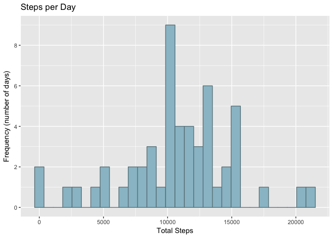
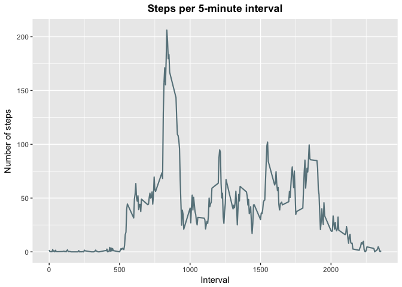
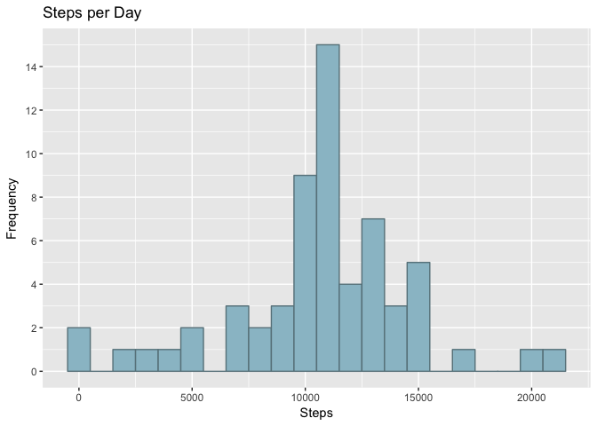
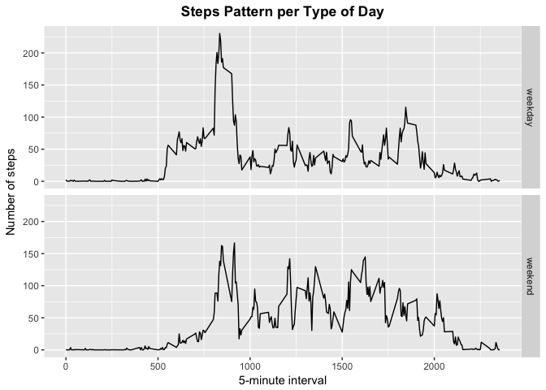

# Reproducible Research: Peer Assessment 1

This document provides step-by-step information for completing the required tasks from Coursera's *Reproducible Research* Course Project #1.

Please read carefully and, if you'd like to run this code in your computer, make sure you have all packages installed:

- dplyr  
- lubridate  
- ggplot2  

## Loading and preprocessing the data

This first chunk of code gets the data from the provided URL, then it creates the data frame "data" by reading from within the ZIP file without extracting. This is done through the command

`read.csv(unzip("motion_data.zip", files = list.files("motion_data.zip"))`

which unzips the file and tells R to read all files within.  

**Note**: this may not work when there are multiple files inside a ZIP.


```r
url = "https://d396qusza40orc.cloudfront.net/repdata%2Fdata%2Factivity.zip"
download.file(url, "motion_data.zip", mode = "wb") 
data = read.csv(unzip("motion_data.zip", files = list.files("motion_data.zip")), header = TRUE, sep = ",") 
```

Next, upon examining the data, we can see that the *date* variable has a class of "factor". It is necessary to convert it to class "date". I have chosen to change that with package `lubridate()`:


```r
library(lubridate)
data$date = ymd(data$date) 
class(data$date)
```

```
## [1] "Date"
```

The output above shows that the variable now is of class "date" and suitable for future calculations.  

## What is mean total number of steps taken per day?

The first question requires a relatively simple calculation. However, it is necessary to remove NA values **as per the assignment instructions**, which states that

> For this For this part of the assignment, you can ignore the missing values in
the dataset.    
> 1. Make a histogram of the total number of steps taken each day  
> 2. Calculate and report the **mean** and **median** total number of steps taken per day

Therefore, it is important to notice that a dataframe with removed NAs might behave differently that one with NAs converted to zero. When data is not available, then there is **no data** for that observation or period. When the reading is 0, that means **there is data** for that day and the reading is zero. Essentialy, NA is different than zero.  

Some approaches to aggregating data may lead to a data frame with zeros in lieu of NA. See the example below:


```r
aggregated_steps <- aggregate(data$steps, by=list(data$date), FUN=sum, na.rm=TRUE)
head(aggregated_steps, 10)
```

```
##       Group.1     x
## 1  2012-10-01     0
## 2  2012-10-02   126
## 3  2012-10-03 11352
## 4  2012-10-04 12116
## 5  2012-10-05 13294
## 6  2012-10-06 15420
## 7  2012-10-07 11015
## 8  2012-10-08     0
## 9  2012-10-09 12811
## 10 2012-10-10  9900
```

It is possible to see here that 1st October 2012 has a value of zero. But let's examine the dataset:


```r
head(data, 10)
```

```
##    steps       date interval
## 1     NA 2012-10-01        0
## 2     NA 2012-10-01        5
## 3     NA 2012-10-01       10
## 4     NA 2012-10-01       15
## 5     NA 2012-10-01       20
## 6     NA 2012-10-01       25
## 7     NA 2012-10-01       30
## 8     NA 2012-10-01       35
## 9     NA 2012-10-01       40
## 10    NA 2012-10-01       45
```

Here, 1st October 2012 has a value of NA. 

Therefore, the mean and median for the total of days (61) will be different than these calculations for the days **for which there is available data**. 

#### Plotting steps per day

For this operation (and all of the following), I have chosen to use package `dplyr`, which graetly simplifies the synthax and is very intuitive:


```r
library(dplyr)
steps_day = summarise(group_by(na.omit(data), date), steps = sum(steps))
head(steps_day, 10)
```

```
## # A tibble: 10 x 2
##          date steps
##        <date> <int>
##  1 2012-10-02   126
##  2 2012-10-03 11352
##  3 2012-10-04 12116
##  4 2012-10-05 13294
##  5 2012-10-06 15420
##  6 2012-10-07 11015
##  7 2012-10-09 12811
##  8 2012-10-10  9900
##  9 2012-10-11 10304
## 10 2012-10-12 17382
```
This dataframe does NOT contain the days for which there is no data, therefore 1st October 2012 (for instance) has been omitted. Readings are missing for a total of 8 days, so we'll have a total of 53 days 

The plot uses package `ggplot2`:


```r
library(ggplot2)

ggplot(steps_day, aes(x=steps)) +
        geom_histogram(col="lightblue4", fill="lightblue3") +
        ggtitle("Steps per Day") +
        xlab("Total Steps")+ylab("Frequency (number of days)") + 
        scale_y_continuous(breaks = seq(0, 10, 2)) 
```

<!-- -->

#### Calculating mean and median

To calculate mean and median, I will use the `steps_day` dataframe used to plot. For the mean:


```r
mean(steps_day$steps)
```

```
## [1] 10766.19
```
Then, for the median:

```r
median(steps_day$steps)
```

```
## [1] 10765
```
Notice that, replacing NAs with 0 as shown before would produce a mean of `9354.23`. That happens because the sum is being divided by 61 (the total of days) and not 53, which is the total of days for which there is data. Also, the median would be `10395`. This is a long standing discussion in the field of statistics, with the generally accepted idea being that one should only perform calculations for observations with actual data, hence why an imputation is sometimes performed -- as we'll do ahead. 

## What is the average daily activity pattern?

To compute the average daily pattern, it is necessary to group the readings by 5-minute intervals. Considering that the day has 1440 minutes, we can expect a data frame with 288 observations.  
The code for assmebling a data frame with steps for each interval -- using `dplyr` -- is as follows:


```r
steps_interval = summarise(group_by(na.omit(data), interval), steps = mean(steps))
```

Then to build the required plot the code is:


```r
ggplot(steps_interval, aes(interval, steps)) + 
        geom_line(col = "lightblue4", lwd = 0.75) + 
        xlab("Interval") + ylab("Number of steps") + 
        ggtitle("Steps per 5-minute interval") +
        theme(plot.title = element_text(face = "bold", hjust = 0.5))
```

<!-- -->

To determine which interval has the maximum number of steps accross the dataset, the following `dplyr` code will select (filter) the observation with the highest value for steps:


```r
max_steps = filter(steps_interval, steps==max(steps))
max_steps
```

```
## # A tibble: 1 x 2
##   interval    steps
##      <int>    <dbl>
## 1      835 206.1698
```
This shows that the 8:35 interval has the hightest value, with over 206 steps in average.

## Imputing missing values

Imputting missing values can be a rather challenging task. For this assignment, there were two main possibilities: take the daily average and use it for the missing days or use the 5-minute interval average to complete the missing values. I have decided to perform the latter, since the former would only give me the daily totals and not the interval average, which is needed to answer question #4.  
The first question requires a calculation of the total missing values. This can be achieved with the following `dplyr` code:


```r
count(filter(data, is.na(steps)))
```

```
## # A tibble: 1 x 1
##       n
##   <int>
## 1  2304
```

This shows that there are 2304 missing values in total. It corresponds to 8 full days without available data.  
The next task is to find a way to add those values -- the mean for each interval -- to the original dataset. In cases such as this, it might be preferable to duplicate the dataset, so as to preserve the original data. The code below uses `dplyr` and uses the "steps_interval" object created before to read the averages for the 5-minute intervals:


```r
newdata=data
newdata$steps <- ifelse(is.na(data$steps), round(steps_interval$steps[match(data$interval, steps_interval$interval)],0), data$steps)
head(newdata)
```

```
##   steps       date interval
## 1     2 2012-10-01        0
## 2     0 2012-10-01        5
## 3     0 2012-10-01       10
## 4     0 2012-10-01       15
## 5     0 2012-10-01       20
## 6     2 2012-10-01       25
```
By checking the 'newdata' data frame, it is possible to see that there are rounded values for steps where they were previously missing.  
The next task is to plot a histogram of the dataset with imputted values. First, it is necessary to create a new data frame with aggregated values per day, like the one build for the first plot:

```r
steps_day_complete = summarise(group_by(newdata, date), steps = sum(steps))
```
Then, plot using that data:


```r
ggplot(steps_day_complete, aes(x=steps), binwidth = 10) +
        geom_histogram(col="lightblue4", fill="lightblue3", binwidth = 1000) +
        ggtitle("Steps per Day") +
        xlab("Steps") + ylab("Frequency") +
        scale_y_continuous(breaks = seq(0, 16, 2))
```

<!-- -->

We can see there's an increase in days averaging from 10500 to 11500 steps. It is now possible to calculate the mean and median for the new dataset:


```r
mean(steps_day_complete$steps)
```

```
## [1] 10765.64
```


```r
median(steps_day_complete$steps)
```

```
## [1] 10762
```

Imputting values with this technique did not significantly alter the initial mean and median values. (*Please bear in mind that different approaches may yield higher differences in mean and median values.*)

## Are there differences in activity patterns between weekdays and weekends?

For this part of the assignment, it is necessary to create a new variable for the day of the week. The function `weekdays()` comes in handy for that purpose:


```r
newdata = newdata %>%
          mutate(dayofweek = weekdays(date))
```

A new variable 'dayofweek' has now the week days for all observations. Then, the next step is to create a categorical variable for the type of day -- weekday or weekend:


```r
newdata = newdata %>%
          mutate(cat_day = as.factor(ifelse(dayofweek %in% c("Saturday", "Sunday"), "weekend", "weekday")))
```

The new variable `cat_day` returns the type of day for each observation. With that, is it possible to create the datasets required for the plot:


```r
wkday = filter(newdata, cat_day == "weekday") %>%
        group_by(interval) %>%
        summarise(avg_steps = mean(steps)) %>%
        mutate(daytype = "weekday")

wkend = filter(newdata, cat_day == "weekend") %>%
        group_by(interval) %>%
        summarise(avg_steps = mean(steps)) %>%
        mutate(daytype = "weekend")

full_data = bind_rows(wkday,wkend)
```

The next step is to plot using 'full_data', which has the averages split by type of day:


```r
ggplot(full_data, aes(interval, avg_steps)) + 
    geom_line() + 
    facet_grid(daytype ~ .) +
    xlab("5-minute interval") + ylab("Number of steps") +
    ggtitle("Steps Pattern per Type of Day") +
    theme(plot.title = element_text(face = "bold", hjust = 0.5))
```

<!-- -->

The difference between weekdays and weekends is noticable, although the activity within the 9:00 to 10:00 AM bracket seems to be high on both types of days.
